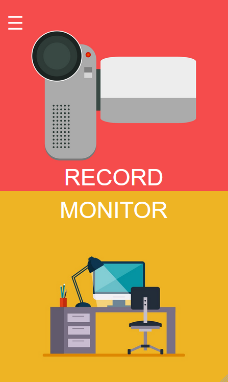
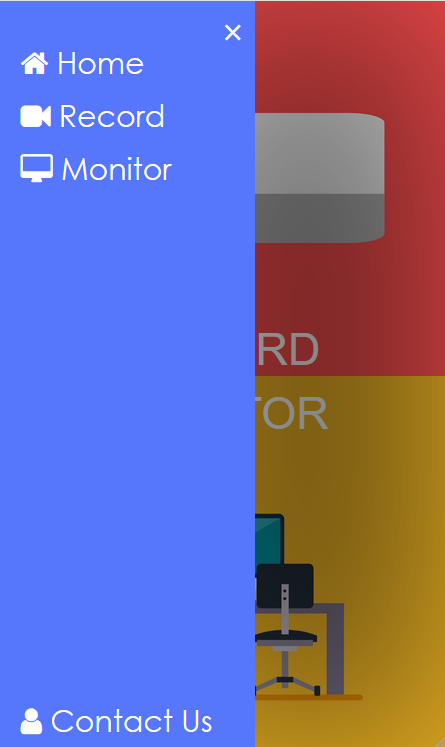

<h1 align="center">
  <a href="https://github.com/abhishekashyap/CamAlert">
    
  </a>
  <br>CamAlert<br>
</h1>

<h4 align="center">
    CamAlert turns old camera hardware or existing camera into intelligent camera system
</h4>

## Screenshots





## Getting Started

The desktop app is based on electron with express server and uses OpenCV for AI features.
The mobile app is wrapped in Cordova

### Installing

Clone the repo then use

```
$cd DesktopApp/
$npm install
```

To start the app use

```
$npm start
```

## Downloads
<!-- * [Releases](https://github.com/abhishekashyap/YoutubeMusic/releases) -->

## Built With

* [Electron](https://electronjs.org) - The web framework used for development of desktop GUI applications.

* [Socket.io](https://socket.io) - Socket.IO enables real-time bidirectional event-based communication.

## Coming soon

* Crowd detection
* Face recognition based attendance system
* Fire detection
* Stable version
* Screenshots

## Contributing

Please read [CONTRIBUTING.md](CONTRIBUTING.md) for details on our code of conduct, and the process for submitting pull requests to us.

## Team

| [](https://github.com/abhishekashyap) | [](https://github.com/kartik918) | [](https://github.com/NB134) | [](https://github.com/PulkitBanta) | [](https://github.com/shubhamgoel2525) |
| --- | --- | --- | --- | --- |
| [Abhishek Kashyap](https://github.com/abhishekashyap) | [Kartik Choudhary](https://github.com/kartik918) | [Nischey Badyal](https://github.com/NB134) | [Pulkit Banta](https://github.com/PulkitBanta) | [Shubham Goel](https://github.com/shubhamgoel2525) |

## License

This project is licensed under the GNU General Public License v3.0 - see the [LICENSE](LICENSE) file for details